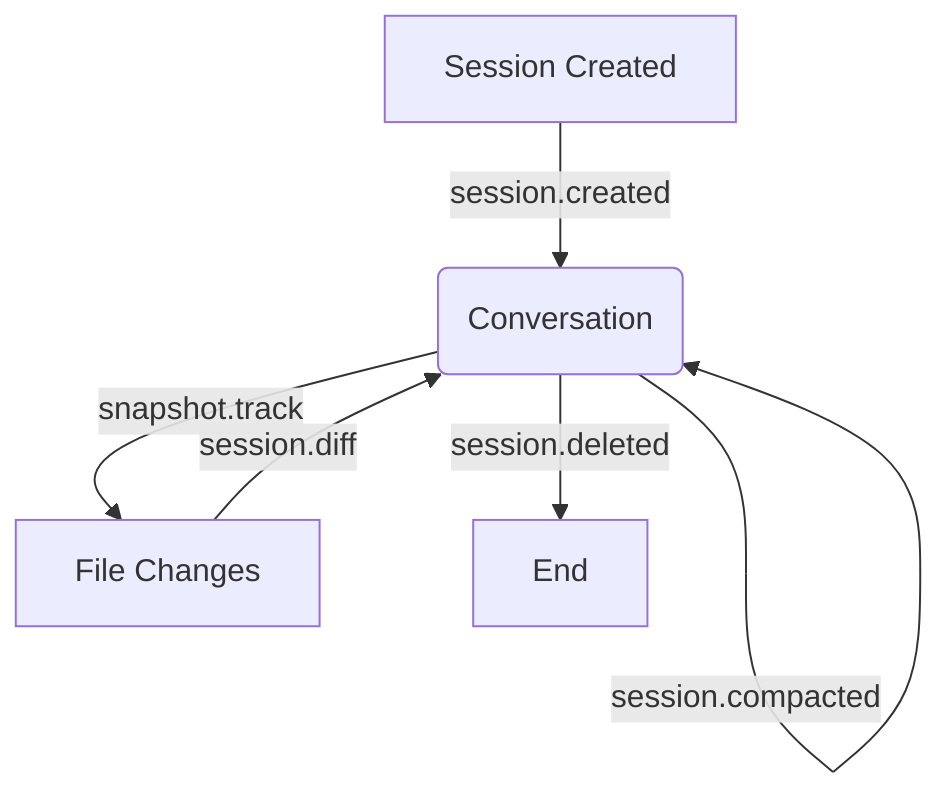

# OpenCode Events & Hooks Reference

This document provides a comprehensive reference for the event system (Bus Events) and Plugin Hooks in OpenCode.

---

## 1. Bus Events (`packages/opencode/src/bus/`)

OpenCode uses a central bus for publishing and subscribing to system events. Many of these events are also exposed globally via SSE (Server-Sent Events) at `/global/event`.

### Session Events

| Event Name          | File:Line                   | Trigger Condition                                                          |
| :------------------ | :-------------------------- | :------------------------------------------------------------------------- |
| `session.created`   | `session/index.ts:192`      | Fired when a new session is created.                                       |
| `session.updated`   | `session/index.ts:206`      | Fired when session metadata (title, time, etc.) is updated.                |
| `session.deleted`   | `session/index.ts:311`      | Fired when a session is deleted.                                           |
| `session.diff`      | `session/summary.ts:58`     | Fired when a summary of changes is generated for a message.                |
| `session.error`     | `session/processor.ts:363`  | Fired when a session encountered an unrecoverable error during processing. |
| `session.status`    | `session/status.ts:62`      | Fired when session status changes (`idle`, `busy`, `retry`).               |
| `session.idle`      | `session/status.ts:68`      | (Deprecated) Fired when session becomes idle.                              |
| `session.compacted` | `session/compaction.ts:189` | Fired after session history has been successfully compacted.               |

### Message Events

| Event Name             | File:Line              | Trigger Condition                                                                    |
| :--------------------- | :--------------------- | :----------------------------------------------------------------------------------- |
| `message.updated`      | `session/index.ts:321` | Fired when a message is updated in storage.                                          |
| `message.removed`      | `session/index.ts:334` | Fired when a message is removed.                                                     |
| `message.part.updated` | `session/index.ts:375` | Fired when a message part (text, tool, etc.) is updated or has new data (streaming). |
| `message.part.removed` | `session/index.ts:350` | Fired when a message part is removed.                                                |

### System & Infrastructure Events

| Event Name                      | File:Line                 | Trigger Condition                                                                |
| :------------------------------ | :------------------------ | :------------------------------------------------------------------------------- |
| `server.instance.disposed`      | `bus/index.ts:11`         | Fired when an instance of the server is disposed.                                |
| `server.connected`              | `server/server.ts:153`    | Fired when a global event stream (SSE) connection is established.                |
| `global.disposed`               | `server/server.ts:60`     | Fired when the global server is being shut down.                                 |
| `installation.updated`          | `cli/upgrade.ts:23`       | Fired after a successful CLI upgrade.                                            |
| `installation.update-available` | `cli/upgrade.ts:17`       | Fired when a newer version of OpenCode is detected.                              |
| `lsp.updated`                   | `lsp/index.ts:258`        | Fired when LSP server list or state is updated.                                  |
| `lsp.client.diagnostics`        | `lsp/client.ts:61`        | Fired when an LSP server sends new diagnostic information.                       |
| `pty.created`                   | `pty/index.ts:164`        | Fired when a new PTY session is started.                                         |
| `pty.updated`                   | `pty/index.ts:177`        | Fired when PTY metadata (title, size) changes.                                   |
| `pty.exited`                    | `pty/index.ts:161`        | Fired when a PTY process exits.                                                  |
| `pty.deleted`                   | `pty/index.ts:192`        | Fired when a PTY session is removed.                                             |
| `project.updated`               | `project/project.ts:121`  | Fired when project metadata (name, icon) is updated.                             |
| `vcs.branch.updated`            | `project/vcs.ts:55`       | Fired when the current git branch changes.                                       |
| `file.edited`                   | `tool/write.ts:75`        | Fired after a file is edited via `write` or `edit` tools.                        |
| `file.watcher.updated`          | `file/watcher.ts:56`      | Fired when the file system watcher detects a change (`add`, `change`, `unlink`). |
| `permission.updated`            | `permission/index.ts:140` | Fired when a new permission request is pending.                                  |
| `permission.replied`            | `permission/index.ts:153` | Fired when a user responds to a permission request.                              |
| `todo.updated`                  | `session/todo.ts:29`      | Fired when the session todo list is updated.                                     |
| `command.executed`              | `session/prompt.ts:1374`  | Fired when a custom slash command (e.g. `/init`) is executed.                    |

### Example Payloads

#### `session.created`

```json
{
  "type": "session.created",
  "properties": {
    "info": {
      "id": "01JGY7J...",
      "projectID": "global",
      "directory": "/Users/name/project",
      "title": "New session - 2025-12-25T...",
      "version": "0.0.3",
      "time": {
        "created": 1735123456789,
        "updated": 1735123456789
      }
    }
  }
}
```

#### `message.part.updated` (Streaming Text)

```json
{
  "type": "message.part.updated",
  "properties": {
    "part": {
      "id": "01JGY7K...",
      "sessionID": "01JGY7J...",
      "messageID": "01JGY7M...",
      "type": "text",
      "text": "Hello world"
    },
    "delta": "world"
  }
}
```

---

## 2. Plugin Hooks (`packages/plugin/src/index.ts`)

Plugins can intercept and modify core behavior by implementing these hooks.

| Hook Name                              | Triggered From              | Has SessionID? | Purpose                                                              |
| :------------------------------------- | :-------------------------- | :------------- | :------------------------------------------------------------------- |
| `event`                                | `plugin/index.ts`           | No             | Listen to any Bus event within the plugin.                           |
| `config`                               | `plugin/index.ts`           | No             | Modify OpenCode configuration.                                       |
| `tool`                                 | `plugin/index.ts`           | No             | Register new tools.                                                  |
| `auth`                                 | `plugin/index.ts`           | No             | Register custom authentication providers.                            |
| `chat.message`                         | `session/prompt.ts:980`     | **Yes**        | Intercept new user messages before they are saved.                   |
| `chat.params`                          | `session/llm.ts:79`         | **Yes**        | Modify parameters (temperature, etc.) sent to the LLM.               |
| `permission.ask`                       | `permission/index.ts:123`   | **Yes**        | Intercept permission requests. Can auto-allow or auto-deny.          |
| `tool.execute.before`                  | `session/prompt.ts:343`     | **Yes**        | Called before a tool is executed. Can modify arguments.              |
| `tool.execute.after`                   | `session/prompt.ts:375`     | **Yes**        | Called after a tool completes. Can modify output.                    |
| `experimental.chat.messages.transform` | `session/prompt.ts:528`     | ❌ **No**      | Transform the list of messages sent to the LLM. **BLOCKED by #6142** |
| `experimental.chat.system.transform`   | `session/llm.ts:65`         | ❌ **No**      | Transform the system prompt strings. **BLOCKED by #6142**            |
| `experimental.session.compacting`      | `session/compaction.ts:135` | **Yes**        | Customize the compaction prompt and context.                         |
| `experimental.text.complete`           | `session/processor.ts:314`  | **Yes**        | Intercept and modify final text output from the assistant.           |

**⚠️ BLOCKED HOOKS**: The `experimental.chat.messages.transform` and `experimental.chat.system.transform` hooks have empty `{}` input with **no sessionID**, making it impossible to correlate captured data to specific Langfuse traces. This is tracked in [OpenCode PR #6142](https://github.com/sst/opencode/issues/6142).

### Hook Usage Example

```typescript
const myPlugin: Plugin = async ({ client }) => {
  return {
    'chat.params': async (input, output) => {
      console.log(`Modifying params for session ${input.sessionID}`);
      output.temperature = 0.5;
    },
    'tool.execute.before': async (input, output) => {
      if (input.tool === 'bash') {
        output.args.command = 'ls -la'; // override command
      }
    },
  };
};
```

---

## 3. Key Type Definitions

These types are primarily defined in `packages/opencode/src/session/` and exported via the SDK.

### Session.Info

```typescript
export type Session = {
  id: string; // Session identifier (descending ULID)
  projectID: string; // Associated project ID
  directory: string; // Current working directory
  parentID?: string; // Parent session ID (if forked)
  summary?: {
    additions: number;
    deletions: number;
    files: number;
    diffs?: FileDiff[];
  };
  share?: {
    url: string;
  };
  title: string;
  version: string; // OpenCode version when created
  time: {
    created: number;
    updated: number;
    compacting?: number;
    archived?: number;
  };
  revert?: {
    messageID: string;
    partID?: string;
    snapshot?: string;
    diff?: string;
  };
};
```

### Message / MessageV2.Info

```typescript
export type Message = UserMessage | AssistantMessage;

export type UserMessage = {
  id: string;
  sessionID: string;
  role: "user";
  time: { created: number };
  summary?: {
    title?: string;
    body?: string;
    diffs: FileDiff[];
  };
  agent: string;      // Name of the agent being addressed
  model: {
    providerID: string;
    modelID: string;
  };
  system?: string;    // Override system prompt
  tools?: Record<string, boolean>; // Tool overrides
}

export type AssistantMessage = {
  id: string;
  sessionID: string;
  role: "assistant";
  parentID: string;   // The UserMessage ID that triggered this
  time: {
    created: number;
    completed?: number;
  };
  error?: ApiError | AuthError | ...;
  modelID: string;
  providerID: string;
  mode: string;       // Usually the agent name
  path: {
    cwd: string;
    root: string;
  };
  summary?: boolean;  // True if this is a compaction summary
  cost: number;
  tokens: {
    input: number;
    output: number;
    reasoning: number;
    cache: { read: number; write: number };
  };
  finish?: string;    // Finish reason (e.g., "stop", "tool-calls")
}
```

### Part (Message Components)

Messages are composed of multiple parts.

```typescript
export type Part =
  | TextPart // Standard text response
  | ReasoningPart // Thought process/hidden reasoning
  | ToolPart // Tool call and its lifecycle state
  | FilePart // File attachment or uploaded content
  | StepStartPart // Marks beginning of an agentic step
  | StepFinishPart // Marks completion of a step with usage stats
  | SnapshotPart // Git state snapshot
  | PatchPart // Changes made during this message
  | AgentPart // Subagent invocation
  | CompactionPart // Trigger for session history compaction
  | SubtaskPart // Task tool invocation
  | RetryPart; // LLM retry information
```

### FileDiff

```typescript
export type FileDiff = {
  file: string; // Relative path to file
  before: string; // Content before change
  after: string; // Content after change
  additions: number; // Number of lines added
  deletions: number; // Number of lines removed
};
```

---

## 4. Event Flow Diagrams

### Session Lifecycle



### LLM Call Flow

When a user sends a message:

1. **`chat.message` Hook**: Triggered first. Allows modification of the user message/parts.
2. **Message Saved**: `message.updated` + `message.part.updated` events fired.
3. **Loop Begins**:
   - **`experimental.chat.messages.transform` Hook**: Can modify history sent to LLM.
   - **`experimental.chat.system.transform` Hook**: Can modify system instructions.
   - **`chat.params` Hook**: Final chance to modify LLM parameters.
4. **Assistant Response Starts**: `message.updated` (Assistant Message created).
5. **Streaming Output**: Multiple `message.part.updated` events as text/reasoning arrives.
6. **Tool Calls Detected**:
   - **`tool.execute.before` Hook**: Intercept call.
   - **Execution**: Tool runs.
   - **`tool.execute.after` Hook**: Intercept result.
7. **Step Finish**: `message.part.updated` (StepFinishPart) with usage and cost.
8. **Loop Continues** if `finishReason` is `tool-calls`.

### Tool Execution Flow

1. **Permission Check**: `permission.ask` hook (and `permission.updated` event if manual).
2. **Pre-execution**: `tool.execute.before` hook.
3. **Run**: The tool's `execute` logic runs.
4. **Post-execution**: `tool.execute.after` hook.
5. **Bus Update**: `message.part.updated` reflects the tool's `running` -> `completed`/`error` state.
